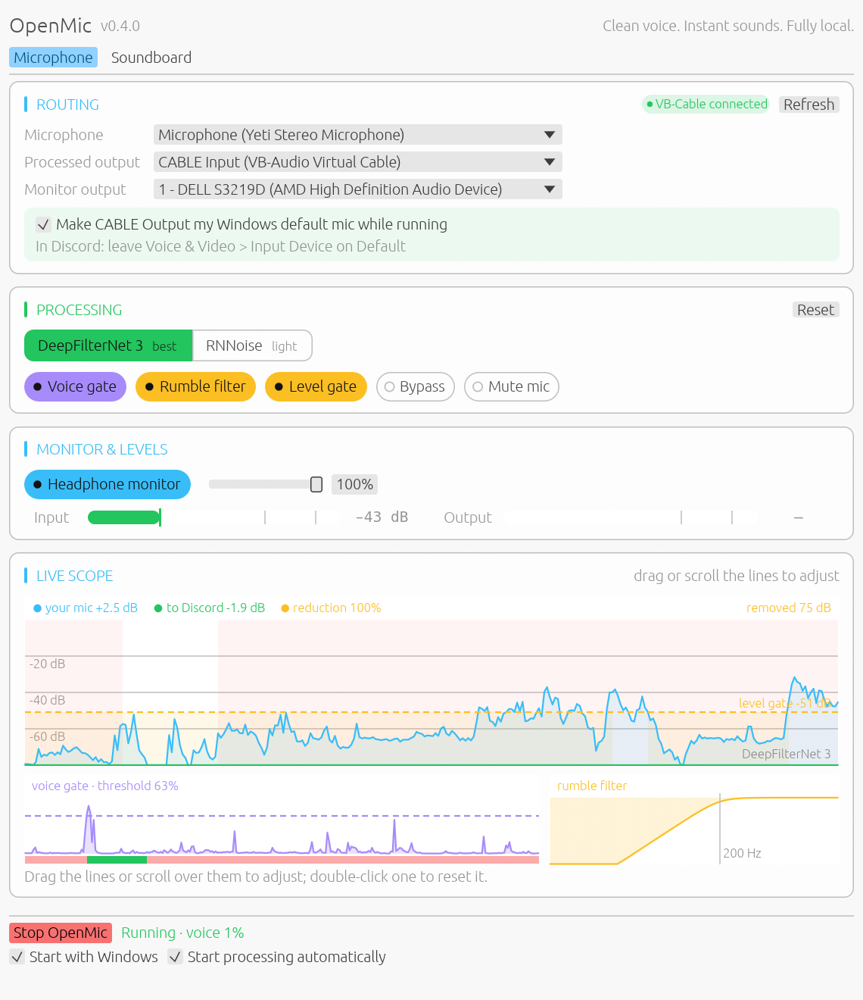

# OpenMic

OpenMic is a local, real-time microphone cleaner and soundboard for Windows. It cleans your voice with DeepFilterNet 3 (or the lighter RNNoise), silences everything that isn't speech, mixes optional sound clips, and sends the result to VB-Audio Virtual Cable for Discord or any other voice application.

Audio stays on your computer. Nothing is recorded or uploaded.



## Features

- DeepFilterNet 3 noise suppression (pure-Rust tract runtime, model embedded in the binary) — strong on keyboard clicks and other transient noise, ~2% of one CPU core. Quiet microphones are level-matched into the model and back, so a soft voice isn't mistaken for silence
- RNNoise as a light alternative (vendored xiph source, built via `cc` — no Python, no prebuilt DLLs)
- Voice gate: mutes everything that isn't speech, however loud, using RNNoise's voice detector with a 300 ms hold so word endings survive
- Rumble filter: 4th-order high-pass (80 Hz by default, 40–200 Hz) for desk bumps, hum and handling noise
- Live scope that doubles as the control surface: see your mic against what Discord hears, the voice detector and the rumble filter, then drag or scroll to adjust them
- Opens devices at their native formats and resamples to/from the 48 kHz DSP core
- Selectable microphone, processed output, and headphone monitor; VB-Cable is chosen automatically and made the default microphone while OpenMic runs
- Live routing changes with automatic stream handoff (soundboard playhead preserved)
- Noise-reduction strength, input/output gain and an optional level-based gate
- Live bypass and microphone mute
- Persistent soundboard with independent volume; WAV, FLAC, OGG, MP3, AIFF via symphonia
- Input and output level meters with dB readouts and peak hold
- Automatic settings persistence
- Optional Windows startup and automatic processing; OpenMic waits for a saved device that connects after launch
- Native GUI (egui) that follows your system's light or dark theme

## Requirements

- Windows 10 or 11
- [Rust](https://rustup.rs) (stable) and MSVC build tools
- Network access on the first build: DeepFilterNet is fetched from its GitHub repository at a pinned commit
- A C compiler for the vendored RNNoise: MSVC `cl.exe` cannot compile the VLA usage in `pitch.c`, so the build uses `clang` (e.g. the one shipped with AMD ROCm, or LLVM/Clang for Windows). It must target the MSVC ABI.
- [VB-Audio Virtual Cable](https://vb-audio.com/Cable/) (recommended output)

## Build & run

```bat
git clone https://github.com/DevanMetz/openmic.git
cd openmic
cargo run --release
```

The binary is `target\release\openmic.exe`. No administrator access needed; VB-Cable's driver install may require it.

## Discord setup

1. Run OpenMic. If VB-Cable isn't installed, click **Get VB-Cable**, run its setup as administrator, and OpenMic switches to it on its own once it appears.
2. Select your physical microphone.
3. OpenMic sends your voice to **CABLE Input (VB-Audio Virtual Cable)** automatically on every launch. It never defaults to your speakers, which would play your mic back out loud.
4. While it runs, OpenMic also makes **CABLE Output** your Windows default microphone, so Discord's **Input Device** can stay on **Default**. Your previous default comes back when processing stops or OpenMic closes; after a crash, OpenMic restores it when processing next stops. Untick **Make CABLE Output my Windows default mic while running** to set Discord's input to **CABLE Output** by hand instead.
5. In Discord (**User Settings → Voice & Video**), disable Discord/Krisp noise suppression to avoid double processing.

The defaults (DeepFilterNet 3, voice gate, rumble filter) aim to send only your voice.

## Devices that connect late

OpenMic keeps saved microphone and monitor choices when they are missing at launch. With **Start processing automatically** enabled, or after you click **Start OpenMic**, it waits for all selected devices to connect. The processed output returns to VB-Cable at launch whenever it is available. **Stop OpenMic** cancels the wait; connecting a device afterwards does not restart processing. Use **Refresh** under **Routing** to replace a missing device with an available one.

If audio stops after a device is unplugged while processing, reconnect it and start processing again. If the window still shows **Running**, click **Stop OpenMic** first. Use **Refresh** if you want to select a different device or its name has changed.

## Adjusting

Choose a model and switch filters on or off in **Processing**. Use the **Live scope** to tune their settings: drag a control, scroll over it for fine steps, or double-click it to reset that setting. **Reset** in **Processing** restores all processing settings.

| Scope control | Drag changes | Wheel step |
|---|---|---|
| Blue line (your mic) or its chip | Input gain | 0.5 dB |
| Green line (to Discord) or its chip | Output gain | 0.5 dB |
| **reduction** chip | Noise-reduction strength | 1% |
| Dashed amber line (when **Level gate** is on) | Level-gate threshold | 1 dB |
| Voice chart | Voice-gate threshold: lower it if quiet words get cut off; raise it if noise opens the gate | 1% |
| Rumble chart | Rumble-filter cutoff; drag left or right | 1 Hz |

The **Monitor & Levels** section shows live input and output levels in dB, with a peak hold marker. The headphone monitor and soundboard volume sliders also take the mouse wheel in 1% steps. Use headphones before enabling the monitor to prevent feedback.

## Soundboard

Open the **Soundboard** tab, click **Add clips**, select one, then press **Play** (or double-click the clip). The clip is mixed into the same processed output Discord receives. Route changes preserve the clip's playhead. **Mute mic** silences your voice without silencing the soundboard.

## Checks

```bat
cargo test
```

The suite covers the voice gate, rumble filter, DeepFilterNet stage settings, model alignment and quiet-voice preservation, the level gate/bypass/mute DSP, scope wheel and touchpad steps, late-device waiting and cancellation, safe routing defaults, soundboard mixing and mute isolation, clip decode/resample, streaming resampler continuity, settings defaults and migration, and RNNoise noise suppression and voice detection.

To compare the models on a real speech recording mixed with fan noise, typing and rumble:

```bat
set OPENMIC_SPEECH_WAV=C:\path\to\speech.wav
cargo test --release evaluate -- --ignored --nocapture
```

## License

MIT. The vendored xiph RNNoise under `vendor/rnnoise/` keeps its own BSD-style license (see `vendor/rnnoise/COPYING`).
