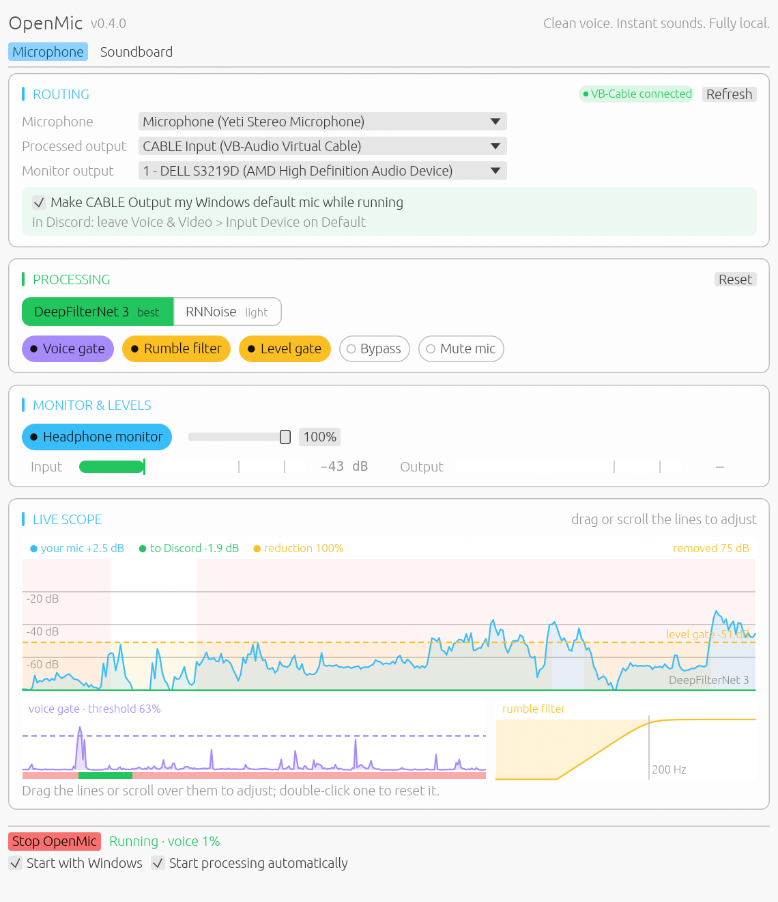

# OpenMic

OpenMic is a local, real-time microphone cleaner and soundboard for Windows. It cleans your voice with DeepFilterNet 3 (or the lighter RNNoise), silences everything that isn't speech, mixes optional sound clips, and sends the result to VB-Audio Virtual Cable for Discord or any other voice application.

Audio stays on your computer. Nothing is recorded unless you use **Record** or speech to text, and nothing is uploaded. The only network requests are the speech model download you ask for and a daily check for new OpenMic releases, which you can turn off.



## Features

- DeepFilterNet 3 noise suppression (pure-Rust tract runtime, model embedded in the binary) — strong on keyboard clicks and other transient noise, ~2% of one CPU core. Quiet microphones are level-matched into the model and back, so a soft voice isn't mistaken for silence
- RNNoise as a light alternative (vendored xiph source, built via `cc` — no Python, no prebuilt DLLs)
- Voice gate: mutes everything that isn't speech, however loud, using RNNoise's voice detector with a 300 ms hold so word endings survive
- Rumble filter: 4th-order high-pass (80 Hz by default, 40–200 Hz) for desk bumps, hum and handling noise
- Live scope that doubles as the control surface: see your mic against what Discord hears, the voice detector and the rumble filter, then drag or scroll to adjust them
- Opens devices at their native formats and resamples to/from the 48 kHz DSP core
- Selectable microphone, processed output, and headphone monitor; VB-Cable is chosen automatically and made the default microphone while OpenMic runs
- Live routing changes with automatic stream handoff (soundboard playheads preserved)
- Recovers on its own when a device is unplugged and plugged back in
- Low, steady latency: output queues hold ~25 ms and track clock drift between devices, so the delay never creeps up over a long session
- Audio threads run in Windows' Pro Audio scheduling class, for fewer dropouts under load
- Noise-reduction strength, input/output gain and an optional level-based gate
- Processing presets (Balanced, Mechanical keyboard, Quiet room, Noisy room, Low CPU) plus your own
- Live bypass and microphone mute
- Global hotkeys for mute, bypass, stopping clips and every soundboard pad; they work while another app (or a game) has focus
- Speech to text: hold a hotkey, talk, and your words are typed into whatever app has focus. Whisper runs on your CPU (candle, pure Rust); the model downloads once from Hugging Face
- Runs in the notification area: close the window and OpenMic keeps working, with mute, bypass and start/stop in the tray menu
- Persistent soundboard with per-pad volume and trim, clip lengths and playback progress on each pad, drag-to-reorder, search, optional overlapping clips, and a soundboard volume; WAV, FLAC, OGG, MP3, AIFF via symphonia
- Record the raw microphone or the audio playing through a Windows output, then save a WAV file or add the take directly to the soundboard
- Input and output level meters with peak hold, beside the gain sliders
- **Test my mic**: record 5 seconds and hear it raw and cleaned on your headphones
- A setup checklist for first runs, and Simple or Advanced processing controls
- A sidebar with Voice, Soundboard, Record, Dictation and Settings pages, and a status panel on every page: whether Discord hears you, your level, **Mute** and **Start/Stop**
- **Collapse to strip**: swap the window for a thin always-on-top bar with your level, **Mute** (click the microphone), the preset, your starred pads and a button to expand again. Drag its right edge to resize it, down to just the microphone. OpenMic reopens the way you left it
- Automatic settings persistence
- Optional Windows startup (straight into the notification area) and automatic processing; OpenMic waits for a saved device that connects after launch
- One copy at a time: launching OpenMic again brings the running window back
- Easy updates: OpenMic checks GitHub for a new release once a day, then downloads it, verifies its SHA-256 checksum and restarts as the new version when you click **Restart to update**; click the version number to check any time
- Native GUI (egui) that follows your system's light or dark theme; resizable, fits short laptop screens, and works with screen readers
- A log file (**Settings → Open log folder**) recording device changes, errors and updates, for bug reports

## Download

Prebuilt Windows x64 executables are attached to each [GitHub release](https://github.com/DevanMetz/openmic/releases). OpenMic itself needs no installer. It requires the [Microsoft Visual C++ v14 Redistributable (x64)](https://learn.microsoft.com/en-us/cpp/windows/latest-supported-vc-redist); install it if Windows reports a missing `VCRUNTIME140.dll`. To build OpenMic yourself, read on.

## Requirements

- Windows 10 or 11
- [Rust](https://rustup.rs) (stable) and MSVC build tools
- Network access on the first build: DeepFilterNet is fetched from its GitHub repository at a pinned commit
- A C compiler for the vendored RNNoise: MSVC `cl.exe` cannot compile the VLA usage in `pitch.c`, so the build uses `clang` (e.g. the one shipped with AMD ROCm, or LLVM/Clang for Windows). It must target the MSVC ABI.
- [VB-Audio Virtual Cable](https://vb-audio.com/Cable/) (recommended output)

## Build & run

```bat
git clone https://github.com/DevanMetz/openmic.git
cd openmic
cargo run --release
```

The binary is `target\release\openmic.exe`. No administrator access needed; VB-Cable's driver install may require it.

## Discord setup

The **Get set up** checklist at the top of the **Voice** page walks through these steps and ticks each one off; hide it once you're done.

1. Run OpenMic. If VB-Cable isn't installed, click **Get VB-Cable**, run its setup as administrator, and OpenMic switches to it on its own once it appears.
2. Select your physical microphone.
3. OpenMic sends your voice to **CABLE Input (VB-Audio Virtual Cable)** automatically on every launch. It never defaults to your speakers, which would play your mic back out loud. Automatic microphone selection skips **CABLE Output** to avoid feeding the processed audio back into itself.
4. While it runs, OpenMic also makes **CABLE Output** your Windows default microphone, so Discord's **Input Device** can stay on **Default**. Your previous default comes back when processing stops or OpenMic closes; after a crash, OpenMic restores it when processing next stops. Untick **Make CABLE Output my Windows default mic while running** to set Discord's input to **CABLE Output** by hand instead.
5. In Discord (**User Settings → Voice & Video**), disable Discord/Krisp noise suppression to avoid double processing.
6. Click **Test my mic** under **Processing**: speak for 5 seconds, then play **Raw** and **Cleaned** to hear what Discord hears. The test plays on your headphone monitor output (or the Windows default output), never into VB-Cable. **Cleaned** uses your current settings, so change a preset or slider and play it again.

The defaults (DeepFilterNet 3, voice gate, rumble filter) aim to send only your voice.

## Devices that connect late

OpenMic keeps saved microphone and monitor choices when they are missing at launch. With **Start processing automatically** enabled, or after you click **Start**, it waits for all selected devices to connect. The processed output returns to VB-Cable at launch whenever it is available. **Stop** cancels the wait; connecting a device afterwards does not restart processing. Use **Refresh** under **Settings → Routing** to replace a missing device with an available one.

If a device is unplugged while processing, OpenMic shows **reconnecting…** and starts again as soon as it is back; VB-Cable stays your default microphone meanwhile. **Stop** cancels the wait. Use **Refresh** if you want to select a different device or its name has changed. The headphone monitor only needs to be connected while **Headphone monitor** is on.

## Adjusting

**Processing** has two views. **Simple** shows a preset, one **Noise reduction** slider and **Bypass**. **Advanced** adds the model choice, the voice gate, rumble filter and level gate, and their charts on the live scope. Choose a model and switch filters on or off, or pick a starting point from **Preset**. Type a name in that menu and click **Save current** to keep your own settings as a preset. Use the **Live scope** and the three sliders beside it to tune their settings: drag a control, scroll over it for fine steps, or double-click it to reset that setting. **Reset** in **Processing** restores all processing settings.

| Scope control | Drag changes | Wheel step |
|---|---|---|
| **Your mic** slider or the blue line | Input gain | 0.5 dB |
| **To Discord** slider or the green line | Output gain | 0.5 dB |
| **Reduction** slider | Noise-reduction strength | 1% |
| Dashed amber line (when **Level gate** is on) | Level-gate threshold | 1 dB |
| Voice chart | Voice-gate threshold: lower it if quiet words get cut off; raise it if noise opens the gate | 1% |
| Rumble chart | Rumble-filter cutoff; drag left or right | 1 Hz |

Level meters beside the **Your mic** and **To Discord** sliders show the input and output peaks, with a peak hold marker. **Headphone monitor** and its volume are on the **Voice** page and play on the monitor output chosen under **Settings → Routing**; use headphones before enabling it to prevent feedback. The monitor and soundboard volume sliders also take the mouse wheel in 1% steps. OpenMic reopens at the size and place you left it.

Settings are saved automatically using atomic file replacement, so an interrupted write leaves the previous settings intact. If saving fails, the status panel shows **Settings not saved · retrying…**; hover over it for details. OpenMic retries while it runs.

## Soundboard

Open the **Soundboard** page, click **Add clips**, then click a pad to play it. Click the pad again to restart the clip, or use **Stop clips** to end playback. Each pad shows the clip's length and, while it plays, its progress. Drag a pad onto another to reorder the board; with more than nine clips, a search box filters them by name. Click the star on a pad to put it on the strip. Right-click a pad to set its own volume, a hotkey, or its trim: drag the start or end on the waveform (or type them) to play only part of the clip. Trimming doesn't change the file. Use the × on a pad to remove it from the board; the audio file stays on disk. **Clip volume** affects the whole soundboard. Turn on **Let clips overlap** to layer pads instead of each one replacing the last (up to 16 at once). Clips are mixed into the same processed output Discord receives, and route changes preserve their playheads. **Mute** silences your voice without silencing the soundboard. Recording has its own **Record** page.

To make a clip, choose **Microphone** (the selected raw mic) or **Computer audio** (the Windows default output or another playback device), then click **Record** and **Stop recording**. While it records, a live waveform, level meter and running file size show what's being captured; afterwards the whole take is drawn so you can check it before keeping it. Name the take and choose **Save WAV** or **Add to soundboard**. Takes are written to disk as they record, so there's no time limit beyond the WAV format's 4 GB (about six hours of 48 kHz stereo); a take you discard is deleted. Computer audio records the full mix playing through the chosen output; recording works even when OpenMic processing is stopped.

If writing a recording fails, OpenMic stops and reports the error. When possible, it recovers the complete audio frames already on disk so you can save the partial take; a recovered take carries a warning.

## Hotkeys and the notification area

Set shortcuts for **Mute mic**, **Bypass processing**, **Stop all clips** and **Speech to text** on the **Settings** page, and for each pad from its right-click menu. Click **Set…**, then press the combination; Esc cancels. Shortcuts need Ctrl or Alt so they can't swallow ordinary typing, except the spare keys F13–F24 that macro pads and stream decks send. A shortcut given to a new action is taken from its old one. If another app already owns a combination, the Settings page says so.

Closing the window hides OpenMic to the notification area, where processing and hotkeys keep running. Click the tray icon to bring the window back; right-click it for **Mute mic**, **Bypass processing**, **Start/Stop OpenMic**, **Collapse to strip** and **Quit OpenMic**. The icon turns red while the mic is muted and amber while speech to text is listening. Untick **Keep running in the notification area when the window closes** on the **Settings** page to make closing quit instead. With **Start with Windows** on, OpenMic starts hidden in the notification area, even if you'd collapsed it to the strip.

## Updates

OpenMic checks GitHub Releases once a day. To check right away, click the version number at the top of the sidebar. When there's a newer version, the top of the window shows **vX.Y.Z available**: click **What's new** to read the release notes, then **Update** and **Restart to update**. OpenMic checks the download against the release's SHA-256 checksum and its Ed25519 signature (made by the release workflow's private key; the public key is built into OpenMic, so a tampered release is refused), replaces its executable in place (so shortcuts and **Start with Windows** keep working), and opens again as the new version. Nothing installs until you click, so an update never interrupts a call. Untick **Check for updates daily** on the **Settings** page to stop the daily check. If OpenMic's folder isn't writable (for example under Program Files), download the new version from the releases page instead.

## Speech to text

On the **Dictation** page, pick a model under **Speech to text** and click **Download** (once; English-only Tiny, Base or Small, or Base and Small for any language). Then set its **Shortcut** at the top of the page. Hold it while you speak and let go: OpenMic transcribes what your selected microphone heard and types it into the app you're using, such as Discord's message box. Choose **Press to start, again to stop** for longer dictation (it stops by itself after 5 minutes). Transcription runs on your PC; the last result can be copied from the Dictation page, including when typing into the target app fails. Apps running as administrator don't accept typed text from OpenMic.

## Logs

OpenMic writes `openmic.log` in its settings folder (`%APPDATA%\OpenMic\OpenMic\config`): startup, processing starts and stops, lost and reconnected devices, audio warnings, default-mic changes, update activity and crashes. Past 1 MB it is renamed to `openmic.old.log` at the next launch. Open the folder from **Settings → Open log folder** and attach the log to a bug report.

## Checks

```bat
cargo clippy --locked --all-targets -- -D warnings
cargo test --locked
```

The suite covers the voice gate, rumble filter, DeepFilterNet stage settings, model alignment and quiet-voice preservation, the level gate/bypass/mute DSP, scope wheel and touchpad steps, late-device waiting, cancellation and reconnecting, safe routing defaults, output priming and clock-drift correction, catching up after a processing stall, soundboard mixing, overlap and mute isolation, clip decode/resample, streaming resampler continuity and treble, settings defaults and migration, presets, hotkey parsing and reassignment, tray commands, the app icon, update version checks, checksum verification and executable replacement, and RNNoise noise suppression and voice detection. CI runs clippy and the tests on every push and pull request; pushing a `v*` tag builds a release.

To compare the models on a real speech recording mixed with fan noise, typing and rumble:

```bat
set OPENMIC_SPEECH_WAV=C:\path\to\speech.wav
cargo test --release evaluate -- --ignored --nocapture
```

## License

MIT. The vendored xiph RNNoise under `vendor/rnnoise/` keeps its own BSD-style license (see `vendor/rnnoise/COPYING`).
